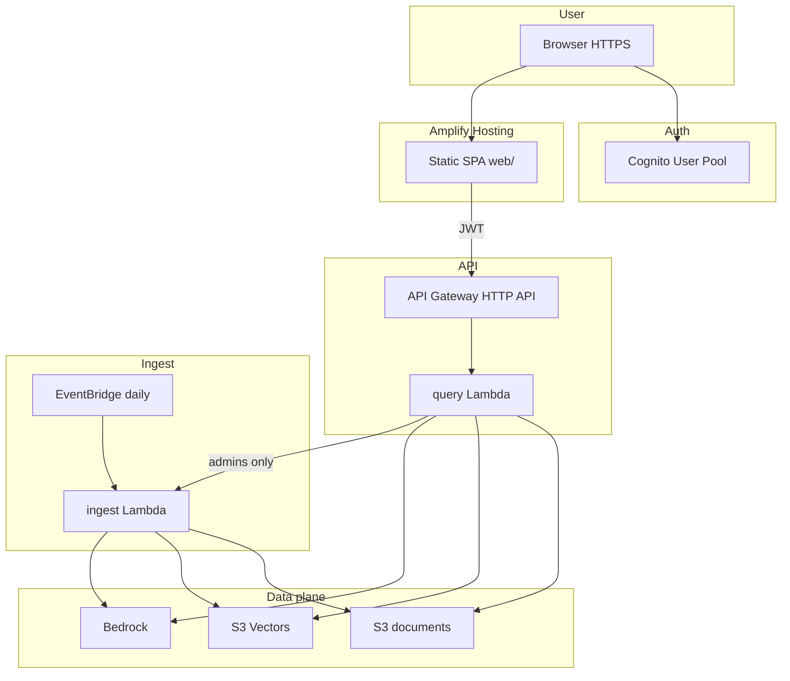
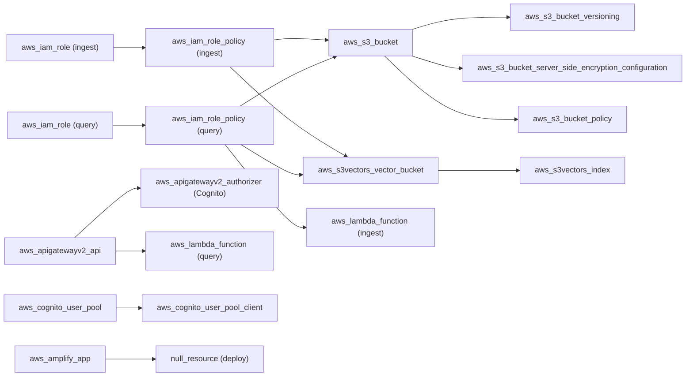

# Design Document

## Overview

This design describes a cloud-native AWS announcements briefing application that provisions S3 Vectors, Amazon Bedrock, Lambda, API Gateway, Cognito, and Amplify resources via Terraform. The system automatically ingests AWS RSS feeds, generates embeddings, stores vectors, and serves a web UI where authenticated users ask questions grounded in recent AWS announcements.

The project follows a flat Terraform structure with snake_case conventions, consistent tagging, and single-region AWS deployment. After `terraform apply`, the system is fully operational with a bootstrapped corpus and a live web UI.

### Key Design Decisions

1. **Flat file layout** — All `.tf` files live at the repository root with no module nesting.
2. **Resource-per-file grouping** — Resources are organized into logical files by concern (Lambda, API Gateway, Cognito, Amplify, etc.).
3. **aws_s3vectors_* native resources** — The Terraform AWS provider (>= 6.24.0) natively supports `aws_s3vectors_vector_bucket` and `aws_s3vectors_index`.
4. **Lambda-based pipeline** — Ingest and query are Lambda functions (not CLI commands), enabling scheduled automation and web UI integration.
5. **Cognito JWT auth** — API Gateway uses Cognito JWT authorizer; admin group gates sensitive operations.
6. **Amplify SPA hosting** — Static web app deployed via `null_resource` provisioner with config injection from Terraform outputs.
7. **Cross-region inference profile** — LLM uses AU inference profile (`au.anthropic.claude-sonnet-4-5-20250929-v1:0`) for ap-southeast-2 routing.
8. **Random bucket prefix** — `random_id` generates globally unique S3 bucket names to avoid conflicts.

## Architecture



## Components and Interfaces

### Terraform File Layout

| File | Purpose |
| ---- | ------- |
| `versions.tf` | Terraform version constraint (`>= 1.5.0`), AWS/random/archive/null provider versions |
| `providers.tf` | AWS provider with region variable and default_tags |
| `main.tf` | Locals: random bucket prefix, bucket names, Amplify origin |
| `variables.tf` | All input variables with types, defaults, descriptions, and validation blocks |
| `outputs.tf` | All output values (app URL, API endpoint, Cognito, buckets, Lambda) |
| `terraform.tfvars` | User-configurable values with `# REPLACE` annotations |
| `data.tf` | Data sources (aws_caller_identity, aws_region) |
| `random.tf` | random_password for Cognito admin auto-generation |
| `s3.tf` | Source documents S3 bucket (versioning, encryption, TLS policy) |
| `s3_vectors.tf` | S3 Vectors bucket and vector index |
| `cognito.tf` | User pool, SPA client, domain, admin group, optional admin user |
| `api_gateway.tf` | HTTP API, JWT authorizer, routes, integrations, stage |
| `lambda_ingest.tf` | Ingest Lambda, IAM, EventBridge schedule, bootstrap invocation |
| `lambda_query.tf` | Query Lambda, IAM, API Gateway permission |
| `amplify.tf` | Amplify app, branch, deploy provisioner |
| `iam.tf` | Shared locals (foundation model ID) |

### Resource Relationships



### Component Details

#### `providers.tf`

```hcl
provider "aws" {
  region = var.aws_region
  default_tags {
    tags = {
      Project     = var.project_name
      Environment = var.environment
      ManagedBy   = "Terraform"
    }
  }
}
```

#### `main.tf` — Shared Locals

- `random_id.bucket_prefix` — 4-byte hex for globally unique bucket names
- `local.source_bucket_name` — `{prefix}-{source_bucket_prefix}-{project_name}-{environment}`
- `local.vector_bucket_name` — `{prefix}-{vector_bucket_name}`
- `local.amplify_origin` — `https://main.{amplify_app.default_domain}`

#### `s3.tf` — Source Documents Bucket

- `aws_s3_bucket` with `force_destroy = true` for demo teardown
- `aws_s3_bucket_versioning` — Enabled
- `aws_s3_bucket_server_side_encryption_configuration` — SSE-S3 (AES256)
- `aws_s3_bucket_policy` — Denies requests without TLS

#### `s3_vectors.tf` — Vector Storage

- `aws_s3vectors_vector_bucket` — Named via `local.vector_bucket_name`
- `aws_s3vectors_index` — 1024 dimensions, cosine metric, float32 data type

#### `lambda_ingest.tf` — Ingest Pipeline

- `data.archive_file` — Zips `lambda/ingest/handler.py` + `rag/*.py`
- `aws_iam_role` + `aws_iam_role_policy` — S3, S3Vectors, Bedrock embed, CloudWatch Logs
- `aws_lambda_function` — Python 3.12, 480s timeout, 512MB
- `aws_cloudwatch_log_group` — 14-day retention
- `aws_cloudwatch_event_rule` + `aws_cloudwatch_event_target` — Daily schedule
- `aws_lambda_invocation` — Bootstrap ingest on first apply
- `aws_lambda_permission` — EventBridge and Query Lambda invoke

#### `lambda_query.tf` — API Handler

- `data.archive_file` — Zips `lambda/query/handler.py` + `rag/*.py`
- `aws_iam_role` + `aws_iam_role_policy` — S3 read, S3Vectors query, Bedrock (embed + LLM via inference profile), Lambda invoke
- `aws_lambda_function` — Python 3.12, 60s timeout, 512MB, CORS origin env var
- `aws_cloudwatch_log_group` — 14-day retention
- `aws_lambda_permission` — API Gateway invoke

#### `cognito.tf` — Authentication

- `aws_cognito_user_pool` — Email-based, strong password policy, email recovery
- `aws_cognito_user_pool_client` — SPA client, no secret, SRP + password auth
- `aws_cognito_user_pool_domain` — Hosted UI domain
- `aws_cognito_user_group` — `admins` group for ingest trigger access
- `aws_cognito_user` + `aws_cognito_user_in_group` — Optional admin user creation

#### `api_gateway.tf` — HTTP API

- `aws_apigatewayv2_api` — HTTP protocol, CORS for Amplify origin
- `aws_apigatewayv2_authorizer` — JWT backed by Cognito
- Routes: `GET /status`, `POST /query`, `POST /ingest` (authenticated) + OPTIONS (unauthenticated)
- `aws_apigatewayv2_stage` — Auto-deploy with configurable throttle limits

#### `amplify.tf` — Web UI Deployment

- `aws_amplify_app` — SPA with 404→200 rewrite
- `aws_amplify_branch` — `main` branch, production stage
- `null_resource.deploy_web` — Runs `scripts/deploy-web.sh` which:
  - Generates `config.js` from template with Terraform outputs
  - Zips web assets and uploads to Amplify via `create-deployment` API

## Data Models

### Variables Schema

| Variable | Type | Default | Validation |
| -------- | ---- | ------- | ---------- |
| `aws_region` | `string` | `"ap-southeast-2"` | Regex `^[a-z]{2}-[a-z]+-\d{1}$` |
| `project_name` | `string` | `"s3-vectors-rag-demo"` | Length 1-64 |
| `environment` | `string` | `"dev"` | One of: dev, staging, prod |
| `source_bucket_prefix` | `string` | `"rag-source-docs"` | Length 3-37 |
| `vector_bucket_name` | `string` | `"rag-vectors"` | Length 3-63 |
| `vector_index_name` | `string` | `"rag-embeddings"` | Length 3-63 |
| `vector_dimension` | `number` | `1024` | Between 1 and 4096 |
| `vector_distance_metric` | `string` | `"cosine"` | One of: cosine, euclidean |
| `embedding_model_id` | `string` | `"amazon.titan-embed-text-v2:0"` | Non-empty |
| `llm_model_id` | `string` | `"au.anthropic.claude-sonnet-4-5-20250929-v1:0"` | Non-empty |
| `ingest_schedule_expression` | `string` | `"cron(0 6 * * ? *)"` | N/A |
| `cognito_admin_email` | `string` | `""` | Sensitive |
| `cognito_admin_password` | `string` | `""` | Sensitive |
| `cognito_callback_urls` | `list(string)` | `[]` | N/A |
| `cognito_logout_urls` | `list(string)` | `[]` | N/A |
| `api_throttle_rate` | `number` | `10` | N/A |
| `api_throttle_burst` | `number` | `50` | N/A |

### Tag Schema

All taggable resources receive via `default_tags`:

| Tag Key | Source |
| ------- | ------ |
| `Project` | `var.project_name` |
| `Environment` | `var.environment` |
| `ManagedBy` | `"Terraform"` |

### IAM Policy Structure

**Ingest Lambda:**

- CloudWatch Logs: CreateLogGroup, CreateLogStream, PutLogEvents (scoped to function log group)
- S3: GetObject, PutObject, ListBucket (source bucket)
- S3 Vectors: PutVectors, QueryVectors, GetVectors, DeleteVectors, ListIndexes (vector bucket)
- Bedrock: InvokeModel (embedding model only)

**Query Lambda:**

- CloudWatch Logs: CreateLogGroup, CreateLogStream, PutLogEvents (scoped to function log group)
- S3: GetObject, ListBucket (source bucket, read-only)
- S3 Vectors: QueryVectors, GetVectors, ListIndexes (vector bucket, read + query)
- Bedrock: InvokeModel (embedding model + LLM inference profile + foundation models for cross-region routing)
- Lambda: InvokeFunction (ingest function, for admin-triggered re-ingest)

## Error Handling

### Terraform Apply Errors

| Error Scenario | Cause | Resolution |
| -------------- | ----- | ---------- |
| Bedrock model access denied | Model not enabled in Bedrock console | Enable model access in AWS Console |
| S3 Vectors bucket creation fails | Region not supported | Use a supported region |
| Bootstrap ingest timeout | Network or Bedrock throttling | Re-run apply or invoke manually |
| Amplify deploy fails | Missing zip/curl/jq | Install prerequisites |

### Runtime Errors

| Error Scenario | Cause | Resolution |
| -------------- | ----- | ---------- |
| 403 on POST /ingest | User not in admins group | Add user to admins group |
| Bedrock throttling | Rate limit exceeded | Lambda has retry logic with exponential backoff |
| Empty query results | Corpus not ingested or stale | Trigger refresh via UI or wait for daily schedule |

## Testing Strategy

### Why Property-Based Testing Does NOT Apply

This project combines Infrastructure as Code (Terraform) with Lambda functions that interact with AWS services. PBT is not appropriate because:

- Terraform configurations are declarative
- Lambda functions are thin API handlers delegating to AWS services
- The RAG library depends on live AWS APIs (Bedrock, S3 Vectors) not suitable for property testing

### Recommended Testing Approach

#### Static Analysis (CI)

- `terraform fmt -check` — Formatting
- `terraform validate` — Syntax and internal consistency
- Markdown lint — Documentation formatting
- Commit message conformance

#### Integration Testing (Post-Apply)

1. Open app URL and sign in
2. Ask a question — verify answer includes sources
3. Trigger corpus refresh (admin) — verify new articles appear
4. Check CloudWatch logs for errors
