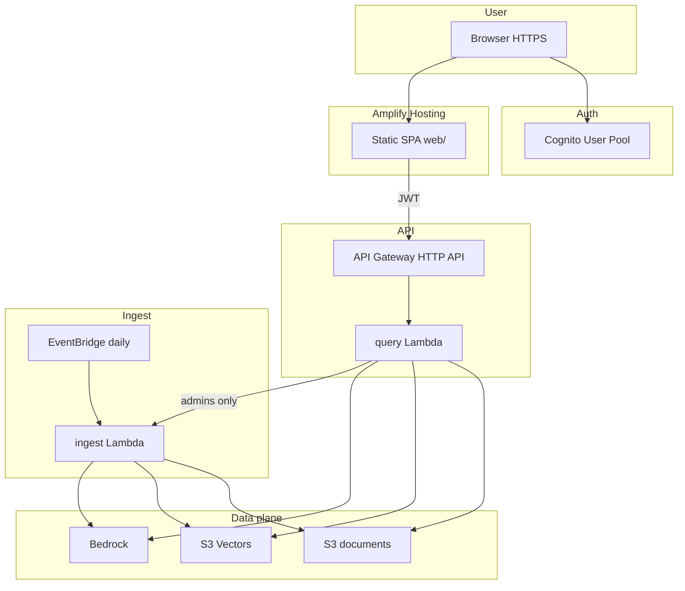

# terraform-aws-s3-vectors-rag-demo

Cloud-native **AWS announcements briefing** demo: live RSS ingest, S3 Vectors retrieval,
Bedrock answers, **Cognito authentication**, **API Gateway**, and an **Amplify-hosted**
web UI.

After `terraform apply`, open the Amplify URL, sign in, and ask questions grounded in
recent [AWS What's New](https://aws.amazon.com/new/) and [AWS News Blog](https://aws.amazon.com/blogs/aws/) posts.

## Architecture



## Security model

| Control | Implementation |
| ------- | -------------- |
| Authentication | Cognito JWT on every API route |
| Authorization | `POST /ingest` requires Cognito `admins` group |
| Least privilege | Separate IAM roles per Lambda; UI has no AWS data access |
| TLS | Amplify HTTPS, API Gateway HTTPS, S3 deny insecure transport |
| Throttling | API Gateway rate/burst limits (configurable) |
| No public invoke | Ingest Lambda invoked only by EventBridge and authenticated API |

## Prerequisites

- Terraform >= 1.5.0, AWS provider >= 6.24.0
- AWS CLI, `jq`, `zip`, `curl`
- Docker **not** required
- Bedrock model access in your region:
  - `amazon.titan-embed-text-v2:0`
  - `au.anthropic.claude-sonnet-4-5-20250929-v1:0`
- IAM permissions for Terraform: S3, S3 Vectors, Lambda, API Gateway, Cognito, Amplify, IAM, EventBridge

## Deploy

### 1. Configure variables

Edit `terraform.tfvars`. Optional — create an admin user at deploy time:

```hcl
cognito_admin_email = "you@example.com"
```

Password is auto-generated when omitted. Retrieve it after apply:

```bash
terraform output -raw cognito_admin_email
terraform output -raw cognito_admin_password
```

Or set `cognito_admin_password` yourself (12+ chars, mixed case, number, symbol).

Or create users manually after apply (see below).

### 2. Apply

```bash
terraform init
terraform apply
```

This provisions infrastructure, runs bootstrap ingest (~120 articles), builds the SPA,
and deploys to Amplify.

### 3. Enable Bedrock models

If bootstrap ingest failed, enable models in the Bedrock console, then use **Refresh corpus**
in the UI (admin only) or wait for the daily schedule.

```bash
./scripts/check-bedrock-access.sh
```

### 4. Open the app

```bash
terraform output -raw app_url
```

Sign in with your Cognito user and ask a question.

## Cognito users

**If you set `cognito_admin_email` + `cognito_admin_password` in tfvars**, that user is
created in the `admins` group automatically.

**Otherwise**, create a user manually:

```bash
POOL_ID="$(terraform output -raw cognito_user_pool_id)"

aws cognito-idp admin-create-user \
  --user-pool-id "${POOL_ID}" \
  --username "you@example.com" \
  --user-attributes Name=email,Value=you@example.com Name=email_verified,Value=true \
  --message-action SUPPRESS

aws cognito-idp admin-set-user-password \
  --user-pool-id "${POOL_ID}" \
  --username "you@example.com" \
  --password "YourSecurePass12!" \
  --permanent

aws cognito-idp admin-add-user-to-group \
  --user-pool-id "${POOL_ID}" \
  --username "you@example.com" \
  --group-name admins
```

Regular users (query only) skip the `admin-add-user-to-group` step.

## Outputs

| Output | Description |
| ------ | ----------- |
| `app_url` | Amplify HTTPS UI |
| `api_endpoint` | API Gateway base URL |
| `cognito_user_pool_id` | Cognito pool |
| `cognito_client_id` | SPA client ID |
| `ingest_function_name` | Ingest Lambda |
| `source_bucket_name` | S3 corpus bucket |
| `vector_bucket_name` | S3 Vectors bucket |

## Refreshing the corpus

| Trigger | When |
| ------- | ---- |
| `terraform apply` | Bootstrap ingest |
| EventBridge | Daily 06:00 UTC |
| UI **Refresh corpus** | Admins only → `POST /ingest` |

Re-deploy UI after web changes:

```bash
terraform apply -replace=null_resource.deploy_web
```

## Project structure

```text
.
├── web/                  # Amplify SPA (primary UI)
├── rag/                  # Shared Python library
├── lambda/ingest/        # Scheduled + on-demand ingest
├── lambda/query/         # API Gateway handler
├── cognito.tf            # User Pool + admins group
├── api_gateway.tf        # HTTP API + JWT authorizer
├── lambda_query.tf       # Query Lambda IAM + function
├── amplify.tf            # Amplify app + deploy
├── lambda_ingest.tf      # Ingest Lambda + schedule
└── scripts/deploy-web.sh # Build config.js + Amplify upload
```

## Local debug (optional)

`app/streamlit_app.py` and `scripts/export-env.sh` remain for local troubleshooting
without Cognito. Not part of the cloud deployment path.

```bash
source scripts/export-env.sh
pip install -r app/requirements.txt
streamlit run app/streamlit_app.py
```

## Destroy

```bash
terraform destroy
```

## License

MIT — see [LICENSE](LICENSE). Copyright (c) 2026 John Ajera.
