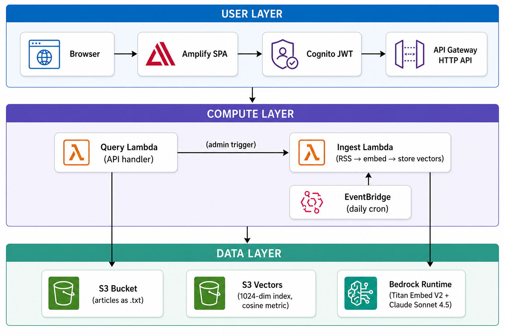
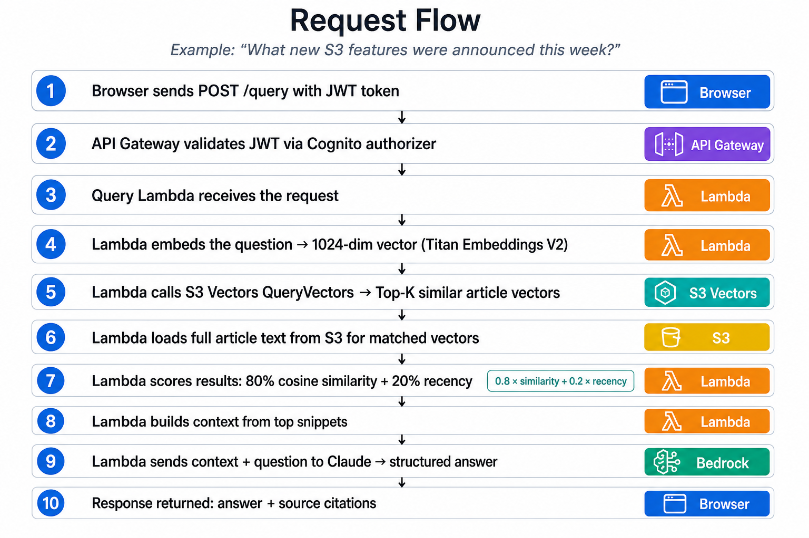
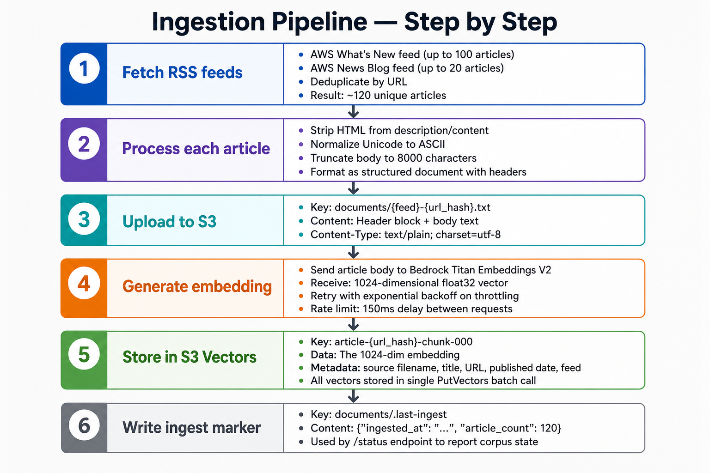
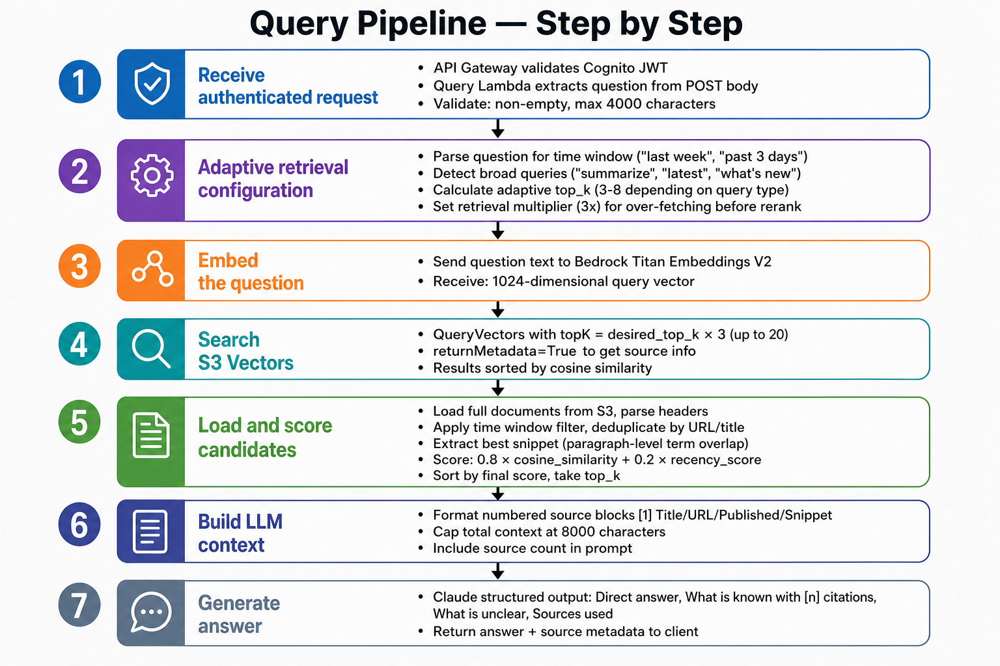
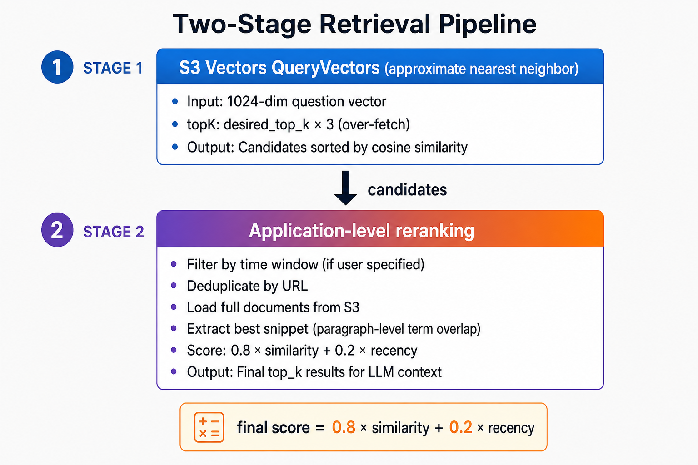
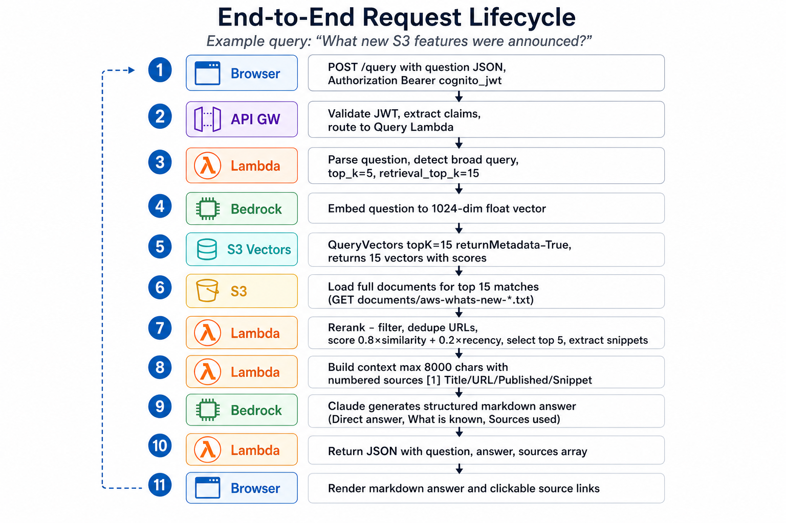

# Walkthrough: Amazon S3 Vectors by Example

This document is a detailed technical walkthrough of the **terraform-aws-s3-vectors-rag-demo** project. It explains what Amazon S3 Vectors is, why it matters, and demonstrates its capabilities through a real-world use case: a cloud-native AWS announcements briefing application powered by Retrieval-Augmented Generation (RAG).

Use this as reference material when creating a walkthrough repository that documents S3 Vectors by example.

---

## Table of Contents

1. [What is Amazon S3 Vectors?](#what-is-amazon-s3-vectors)
2. [The Use Case: AWS News Briefing App](#the-use-case-aws-news-briefing-app)
3. [Why S3 Vectors for This Use Case?](#why-s3-vectors-for-this-use-case)
4. [Architecture Deep Dive](#architecture-deep-dive)
5. [S3 Vectors Concepts Demonstrated](#s3-vectors-concepts-demonstrated)
6. [Data Flow: Ingestion Pipeline](#data-flow-ingestion-pipeline)
7. [Data Flow: Query Pipeline](#data-flow-query-pipeline)
8. [Terraform Resource Walkthrough](#terraform-resource-walkthrough)
9. [IAM Permissions for S3 Vectors](#iam-permissions-for-s3-vectors)
10. [Vector Operations in Code](#vector-operations-in-code)
11. [Embedding Strategy](#embedding-strategy)
12. [Similarity Search and Ranking](#similarity-search-and-ranking)
13. [End-to-End Request Lifecycle](#end-to-end-request-lifecycle)
14. [Deployment Walkthrough](#deployment-walkthrough)
15. [Key Learnings and Patterns](#key-learnings-and-patterns)

---

## What is Amazon S3 Vectors?

Amazon S3 Vectors is a purpose-built vector storage capability within Amazon S3. It allows you to store, index, and query high-dimensional vector embeddings without provisioning or managing a separate vector database.

### Core Concepts

| Concept | Description |
| ------- | ----------- |
| **Vector Bucket** | A specialized S3 bucket type designed for hosting vector indexes. Created via `aws_s3vectors_vector_bucket`. |
| **Vector Index** | A named index within a vector bucket that defines how vectors are stored and searched. Has a fixed dimension, distance metric, and data type. |
| **Dimension** | The number of floating-point values in each vector. Must match your embedding model output (e.g., 1024 for Amazon Titan Embeddings V2). |
| **Distance Metric** | The algorithm for measuring similarity: `cosine` (angle-based, normalized) or `euclidean` (straight-line distance). |
| **Data Type** | Numeric precision for stored vectors: `float32` in this demo. |

### S3 Vectors API Operations

| Operation | Purpose |
| --------- | ------- |
| `PutVectors` | Store one or more vectors with associated metadata |
| `QueryVectors` | Find the most similar vectors to a query vector (Top-K nearest neighbors) |
| `GetVectors` | Retrieve specific vectors by key |
| `DeleteVectors` | Remove vectors from the index |
| `ListIndexes` | Enumerate indexes within a vector bucket |

### How It Differs from Traditional Vector Databases

| Aspect | S3 Vectors | Traditional Vector DB (Pinecone, Weaviate, etc.) |
| ------ | ---------- | ------------------------------------------------ |
| Infrastructure | Fully managed, no servers | Requires cluster provisioning or SaaS |
| Pricing | Pay per operation + storage | Capacity-based or pod-based pricing |
| Provisioning | Single Terraform resource | Complex cluster configuration |
| Scaling | Automatic | Manual or auto-scaling policies |
| Integration | Native AWS IAM, no API keys | Separate auth systems |
| Terraform support | `aws_s3vectors_vector_bucket` + `aws_s3vectors_index` | Provider-specific or custom |

---

## The Use Case: AWS News Briefing App

### Problem Statement

AWS releases dozens of announcements weekly across multiple channels (What's New, AWS News Blog). Keeping up with relevant updates is time-consuming. Users need a way to ask natural-language questions about recent AWS announcements and get accurate, sourced answers.

### Solution

A fully automated cloud-native application that:

1. **Ingests** AWS announcement RSS feeds daily (and on-demand)
2. **Embeds** each article into a 1024-dimensional vector using Amazon Titan Embeddings V2
3. **Stores** vectors in S3 Vectors with metadata (title, URL, published date, feed source)
4. **Queries** the vector index when users ask questions, finding semantically similar articles
5. **Generates** structured answers using Anthropic Claude, grounded in the retrieved articles
6. **Serves** everything through a web UI with Cognito authentication

### What This Demonstrates About S3 Vectors

| Capability | How This Demo Shows It |
| ---------- | --------------------- |
| Vector storage at scale | ~120 articles with 1024-dim embeddings, refreshed daily |
| Metadata-rich vectors | Each vector carries title, URL, published date, feed, chunk ID |
| Similarity search | Cosine similarity to find semantically relevant news articles |
| Integration with Bedrock | End-to-end RAG pipeline using native AWS services |
| IAM-based access control | Scoped permissions per Lambda function |
| Terraform provisioning | Full IaC for vector infrastructure |

---

## Why S3 Vectors for This Use Case?

### Decision Factors

1. **No infrastructure to manage** — The demo needs to be deployable with a single `terraform apply`. S3 Vectors requires no cluster, no capacity planning, no connection pooling.

2. **Native AWS integration** — IAM policies scope access directly. No API keys, no separate auth layer, no VPC endpoints for a managed database.

3. **Terraform-native** — `aws_s3vectors_vector_bucket` and `aws_s3vectors_index` are first-class Terraform resources. The vector infrastructure is defined alongside the rest of the stack.

4. **Cost-effective for demos** — No idle capacity costs. Pay only for operations performed.

5. **Simplicity** — The entire vector storage layer is two Terraform resources and three API calls (PutVectors, QueryVectors, GetVectors).

### When S3 Vectors Is a Good Fit

- Serverless/event-driven architectures
- Moderate-scale vector workloads (thousands to millions of vectors)
- Applications already in the AWS ecosystem
- Teams wanting to avoid managing dedicated vector database infrastructure
- Prototypes and demos that need quick deployment

---

## Architecture Deep Dive

### System Components



### Request Flow



---

## S3 Vectors Concepts Demonstrated

### 1. Creating a Vector Bucket (Terraform)

```hcl
resource "aws_s3vectors_vector_bucket" "this" {
  vector_bucket_name = local.vector_bucket_name
}
```

This creates the container for vector indexes. Think of it as the "database" that holds your "tables" (indexes).

### 2. Creating a Vector Index (Terraform)

```hcl
resource "aws_s3vectors_index" "this" {
  vector_bucket_name = aws_s3vectors_vector_bucket.this.vector_bucket_name
  index_name         = var.vector_index_name

  dimension       = var.vector_dimension     # 1024
  distance_metric = var.vector_distance_metric  # "cosine"
  data_type       = "float32"
}
```

Key decisions made here:

- **Dimension = 1024**: Matches Amazon Titan Embeddings V2 output exactly
- **Distance metric = cosine**: Best for text similarity (direction matters more than magnitude)
- **Data type = float32**: Standard precision for ML embeddings

### 3. Storing Vectors (Python — PutVectors)

```python
s3vectors.put_vectors(
    vectorBucketName=config.vector_bucket,
    indexName=config.vector_index,
    vectors=[
        {
            "key": "article-a1b2c3d4-chunk-000",
            "data": {"float32": [0.123, -0.456, 0.789, ...]},  # 1024 floats
            "metadata": {
                "source": "aws-whats-new-a1b2c3d4.txt",
                "title": "Amazon S3 Vectors now generally available",
                "url": "https://aws.amazon.com/...",
                "published": "2025-06-01T12:00:00Z",
                "feed": "aws-whats-new",
                "chunk": "0",
            },
        }
    ],
)
```

Key points:

- Each vector has a unique **key** (used for retrieval and deduplication)
- **data** contains the actual float array (must match index dimension)
- **metadata** is arbitrary key-value pairs returned with search results

### 4. Querying Vectors (Python — QueryVectors)

```python
response = s3vectors.query_vectors(
    vectorBucketName=config.vector_bucket,
    indexName=config.vector_index,
    queryVector={"float32": query_embedding},  # 1024-dim question embedding
    topK=15,
    returnMetadata=True,
)

for vector in response.get("vectors", []):
    key = vector["key"]
    metadata = vector.get("metadata", {})
    similarity = vector.get("similarity", 0.0)
    # Use metadata to load full document, build context for LLM
```

Key points:

- **queryVector** is the embedded question (same model, same dimension)
- **topK** controls how many results to return (we over-fetch then rerank)
- **returnMetadata=True** includes the stored metadata in results
- Results come back sorted by similarity score (highest first)

---

## Data Flow: Ingestion Pipeline

### Trigger Sources

| Source | When | Purpose |
| ------ | ---- | ------- |
| `terraform apply` | First deployment | Bootstrap corpus (~120 articles) |
| EventBridge | Daily 06:00 UTC | Keep corpus fresh |
| `POST /ingest` API | Admin clicks "Refresh" in UI | On-demand refresh |

### Step-by-Step Ingestion



### Document Format (stored in S3)

```text
# Title: Amazon S3 Vectors is now generally available
# URL: https://aws.amazon.com/about-aws/whats-new/2025/...
# Published: 2025-06-01T12:00:00Z
# Feed: aws-whats-new
# Fetched: 2025-06-08T06:00:00Z

Amazon S3 Vectors enables you to store, query, and retrieve vector
embeddings alongside your data in Amazon S3. With S3 Vectors, you can
build machine learning and generative AI applications that leverage
semantic search without managing separate vector database infrastructure...
```

---

## Data Flow: Query Pipeline

### Step-by-Step Query Processing



### Scoring Formula

```python
final_score = (0.8 × cosine_similarity) + (0.2 × recency_score)

# Recency score uses exponential decay:
recency_score = e^(-age_days / 30)

# Examples:
#   Published today:     recency = 1.0
#   Published 7 days ago: recency ≈ 0.79
#   Published 30 days ago: recency ≈ 0.37
#   Published 90 days ago: recency ≈ 0.05
```

This ensures recent articles get a boost, but highly relevant older articles still surface.

---

## Terraform Resource Walkthrough

### Complete Resource Inventory

| Resource | Type | File | Purpose |
| -------- | ---- | ---- | ------- |
| `random_id.bucket_prefix` | `random_id` | `main.tf` | Globally unique bucket names |
| `aws_s3_bucket.source_documents` | `aws_s3_bucket` | `s3.tf` | Article document storage |
| `aws_s3_bucket_versioning.source_documents` | `aws_s3_bucket_versioning` | `s3.tf` | Enable versioning |
| `aws_s3_bucket_server_side_encryption_configuration.source_documents` | `aws_s3_bucket_server_side_encryption_configuration` | `s3.tf` | SSE-S3 encryption |
| `aws_s3_bucket_policy.source_documents` | `aws_s3_bucket_policy` | `s3.tf` | TLS enforcement |
| `aws_s3vectors_vector_bucket.this` | `aws_s3vectors_vector_bucket` | `s3_vectors.tf` | Vector storage container |
| `aws_s3vectors_index.this` | `aws_s3vectors_index` | `s3_vectors.tf` | 1024-dim cosine index |
| `aws_iam_role.ingest_lambda` | `aws_iam_role` | `lambda_ingest.tf` | Ingest function execution role |
| `aws_iam_role_policy.ingest_lambda` | `aws_iam_role_policy` | `lambda_ingest.tf` | Ingest permissions |
| `aws_lambda_function.ingest` | `aws_lambda_function` | `lambda_ingest.tf` | RSS ingest function |
| `aws_cloudwatch_event_rule.ingest_schedule` | `aws_cloudwatch_event_rule` | `lambda_ingest.tf` | Daily trigger |
| `aws_lambda_invocation.ingest_bootstrap` | `aws_lambda_invocation` | `lambda_ingest.tf` | First-run bootstrap |
| `aws_iam_role.query_lambda` | `aws_iam_role` | `lambda_query.tf` | Query function execution role |
| `aws_iam_role_policy.query_lambda` | `aws_iam_role_policy` | `lambda_query.tf` | Query permissions |
| `aws_lambda_function.query` | `aws_lambda_function` | `lambda_query.tf` | API handler function |
| `aws_cognito_user_pool.main` | `aws_cognito_user_pool` | `cognito.tf` | User authentication |
| `aws_cognito_user_pool_client.spa` | `aws_cognito_user_pool_client` | `cognito.tf` | SPA client config |
| `aws_cognito_user_pool_domain.main` | `aws_cognito_user_pool_domain` | `cognito.tf` | Auth domain |
| `aws_cognito_user_group.admins` | `aws_cognito_user_group` | `cognito.tf` | Admin authorization |
| `aws_apigatewayv2_api.rag` | `aws_apigatewayv2_api` | `api_gateway.tf` | HTTP API |
| `aws_apigatewayv2_authorizer.cognito` | `aws_apigatewayv2_authorizer` | `api_gateway.tf` | JWT validation |
| `aws_amplify_app.ui` | `aws_amplify_app` | `amplify.tf` | SPA hosting |
| `null_resource.deploy_web` | `null_resource` | `amplify.tf` | SPA deployment |

### S3 Vectors-Specific Terraform

The two resources that create the vector storage layer:

```hcl
# The "database" — a container for indexes
resource "aws_s3vectors_vector_bucket" "this" {
  vector_bucket_name = local.vector_bucket_name
  # Note: uses local with random prefix for global uniqueness
}

# The "table" — defines schema (dimension, metric, type)
resource "aws_s3vectors_index" "this" {
  vector_bucket_name = aws_s3vectors_vector_bucket.this.vector_bucket_name
  index_name         = var.vector_index_name  # "rag-embeddings"

  dimension       = var.vector_dimension       # 1024
  distance_metric = var.vector_distance_metric # "cosine"
  data_type       = "float32"
}
```

That's it. Two resources and your vector search infrastructure is ready. Compare this to deploying and managing an OpenSearch cluster, a Pinecone index, or a pgvector extension.

---

## IAM Permissions for S3 Vectors

### S3 Vectors Actions

```json
{
  "Sid": "S3VectorsAccess",
  "Effect": "Allow",
  "Action": [
    "s3vectors:PutVectors",
    "s3vectors:QueryVectors",
    "s3vectors:GetVectors",
    "s3vectors:DeleteVectors",
    "s3vectors:ListIndexes"
  ],
  "Resource": "${vector_bucket_arn}/*"
}
```

### Key IAM Patterns

1. **Resource scoping**: Permissions target `{vector_bucket_arn}/*` — the bucket ARN with wildcard for all indexes within it.

2. **Least privilege per function**:
   - Ingest Lambda: `PutVectors`, `QueryVectors`, `GetVectors`, `DeleteVectors`, `ListIndexes` (full CRUD)
   - Query Lambda: `QueryVectors`, `GetVectors`, `ListIndexes` (read-only + search)

3. **No s3: prefix**: S3 Vectors operations use `s3vectors:` action prefix, not `s3:`. They're a separate service namespace.

4. **ARN format**: The vector bucket ARN comes from `aws_s3vectors_vector_bucket.this.vector_bucket_arn`.

---

## Vector Operations in Code

### Embedding Generation

```python
# rag/ingest.py
def _bedrock_embed(client, model_id, text):
    response = client.invoke_model(
        modelId=model_id,                    # "amazon.titan-embed-text-v2:0"
        contentType="application/json",
        accept="application/json",
        body=json.dumps({"inputText": text}),  # Up to 8000 chars
    )
    payload = json.loads(response["body"].read())
    return payload["embedding"]  # List of 1024 floats
```

### Storing Vectors (Batch)

```python
# rag/ingest.py
def _put_vectors(client, config, vectors):
    client.put_vectors(
        vectorBucketName=config.vector_bucket,
        indexName=config.vector_index,
        vectors=vectors,  # List of {"key": ..., "data": ..., "metadata": ...}
    )
```

### Querying Vectors

```python
# rag/query.py
response = s3vectors.query_vectors(
    vectorBucketName=config.vector_bucket,
    indexName=config.vector_index,
    queryVector={"float32": query_embedding},
    topK=retrieval_top_k,    # Over-fetch for reranking
    returnMetadata=True,     # Include stored metadata
)
```

---

## Embedding Strategy

### Model Choice: Amazon Titan Embeddings V2

| Property | Value |
| -------- | ----- |
| Model ID | `amazon.titan-embed-text-v2:0` |
| Output dimension | 1024 |
| Max input tokens | ~8192 tokens (~8000 characters for safety) |
| Use case | General-purpose text similarity |

### Document Preparation

1. **HTML stripping**: RSS feed content is HTML — strip all tags, decode entities
2. **Unicode normalization**: NFKD normalize + ASCII encode (remove exotic characters)
3. **Truncation**: Cap at 8000 characters with word-boundary truncation
4. **Single chunk**: Each article is one embedding (no multi-chunk splitting for this demo)

### Why Single-Chunk?

For this demo, articles are relatively short (RSS descriptions/excerpts). Benefits:

- Simpler implementation
- One vector per article = easy deduplication
- Metadata maps 1:1 to source documents
- Sufficient for the ~120 article corpus size

For production with longer documents, you'd split into overlapping chunks and store multiple vectors per document.

---

## Similarity Search and Ranking

### Two-Stage Retrieval



### Adaptive Top-K

The system adjusts how many results to use based on the query type:

| Query Type | Top-K | Example |
| ---------- | ----- | ------- |
| Specific question | 3 | "What is S3 Vectors?" |
| Time-bounded | 6 | "What happened last week?" |
| Broad/summary | 5 | "Summarize recent updates" |

### Why Over-Fetch Then Rerank?

S3 Vectors returns results by pure cosine similarity. But for a news briefing app, you also want:

- **Recency** — recent articles should rank higher
- **Deduplication** — same article shouldn't appear twice
- **Relevance** — snippet quality matters for LLM context

Over-fetching 3x and reranking locally gives better final results than relying solely on vector similarity.

---

## End-to-End Request Lifecycle

### Example: User asks "What new S3 features were announced?"



---

## Deployment Walkthrough

### Prerequisites

```bash
# Required tools
terraform --version  # >= 1.5.0
aws --version        # AWS CLI v2
jq --version
zip --version
curl --version

# Required AWS access
# - IAM permissions for: S3, S3Vectors, Lambda, API Gateway, Cognito, Amplify, EventBridge
# - Bedrock model access enabled for Titan Embeddings V2 + Claude
```

### Step 1: Configure

```bash
cp terraform.tfvars.example terraform.tfvars
# Edit terraform.tfvars with your region, admin email, etc.
```

### Step 2: Deploy

```bash
terraform init
terraform apply
# This takes ~3-5 minutes:
# - Creates all infrastructure
# - Runs bootstrap ingest (fetches ~120 articles, generates embeddings)
# - Deploys web UI to Amplify
```

### Step 3: Use

```bash
# Get the app URL
terraform output -raw app_url

# Get admin credentials (if auto-generated)
terraform output -raw cognito_admin_password
```

### What Happens During Apply

```text
1. Provider initialization + random_id generation
2. S3 bucket + S3 Vectors bucket + index creation
3. Cognito user pool + client + admin user creation
4. Lambda functions deployed (zip built from rag/ + handler.py)
5. API Gateway HTTP API + routes + JWT authorizer
6. Amplify app + branch creation
7. EventBridge schedule creation
8. Bootstrap: Lambda invocation fetches RSS, embeds, stores vectors (~2 min)
9. Web deploy: config.js generated, assets zipped, uploaded to Amplify
```

### Step 4: Destroy

```bash
terraform destroy
# force_destroy=true on S3 bucket handles non-empty bucket deletion
```

---

## Key Learnings and Patterns

### 1. S3 Vectors Is Remarkably Simple

The entire vector infrastructure is:

- 2 Terraform resources (bucket + index)
- 3 API calls in application code (PutVectors, QueryVectors, GetVectors)
- Standard IAM permissions (no API keys, no connection strings)

### 2. Dimension Must Match Exactly

The index dimension (1024) must exactly match the embedding model output. A mismatch causes `ValidationException` at PutVectors time. This is configured once at index creation and cannot be changed.

### 3. Metadata Is Your Friend

Store rich metadata with each vector. It's returned with search results and eliminates the need for a separate lookup to understand what a result represents.

### 4. Over-Fetch and Rerank

Pure vector similarity isn't always sufficient for a good user experience. This demo over-fetches 3x and applies application-level scoring (recency, deduplication) for better results.

### 5. Cosine vs. Euclidean

Cosine similarity is preferred for text embeddings because:

- Text embeddings from models like Titan V2 are normalized
- Direction (semantic meaning) matters more than magnitude
- Scores are bounded [0, 1] which simplifies thresholding

### 6. IAM Scoping for S3 Vectors

Use `s3vectors:` prefix (not `s3:`). Scope to the vector bucket ARN with `/*` suffix to cover all indexes. Separate read-only vs. read-write roles by function.

### 7. Single-Region Simplicity

All resources in one region avoids cross-region latency and complexity. The LLM uses an inference profile that routes within the same geographic area.

### 8. Bootstrap Pattern

`aws_lambda_invocation` runs the ingest function during `terraform apply`, so the corpus is ready immediately after deployment. The `replace_triggered_by` lifecycle ensures re-ingest on code changes.

---

## Summary

This project demonstrates Amazon S3 Vectors as a production-ready vector storage service through a real-world RAG application. The key takeaway: **S3 Vectors reduces vector search infrastructure to two Terraform resources and three API calls**, making it an excellent choice for serverless, event-driven architectures that need semantic search capabilities without the operational overhead of managing a dedicated vector database.

The full source code, Terraform configuration, Python library, and web UI serve as a complete reference implementation for building S3 Vectors-powered applications.
